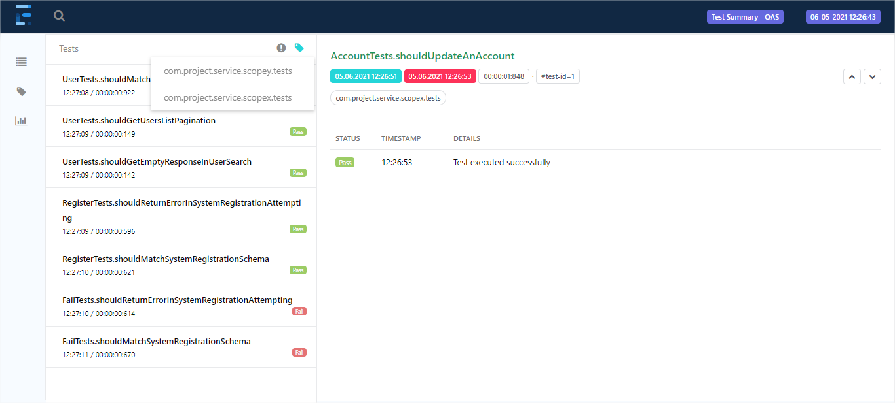

# Java + Rest Assured + Extent Reports

Projeto de automação desenvolvido com o Java + Rest Assured e integrado com relatório HTML para acompanhamento de execuções que teve como objetivo validar de forma prática sua aplicação em um processo de testes automatizados de serviço.

### Requisitos
Para utilização é necessário possuir em sua estação de trabalho:

* IDE para desenvolvimento Java
* JDK 8 >= v1.8.0_281
* JRE 8 >= v1.8.0_281
* Maven >= v3.6.3

### Configurando o ambiente (Windows)

* [Eclipse](https://www.eclipse.org/downloads/packages/release/2019-06/r) ([.zip](https://www.eclipse.org/downloads/download.php?file=/technology/epp/downloads/release/2019-06/R/eclipse-jee-2019-06-R-win32-x86_64.zip))
* [Java](https://mauriciogeneroso.medium.com/s%C3%A9rie-configurando-java-overview-79ded2f8d41b)
* [Maven](https://dicasdejava.com.br/como-instalar-o-maven-no-windows)

### Executando os testes do projeto
Após efetuar a configuração do ambiente e realizar o donwload/clone do repositório em sua estação de trabalho, você poderá executar os teste do projeto de duas maneiras:

**IDE de Desenvolvimento:**

Em uma IDE de sua escolha, importe o projeto na workspace da ferramenta.

Na sequência, encontre o arquivo listado abaixo no explorador de pacotes.
```
./service-test-modules/src/test/java/com/project/service/scopex/runner/ScopexFullSuiteRunner.java
```

Abra o arquivo e inicie uma execução utilizando o recurso 'JUnit Test'

**Maven:**

Com o Maven devidamente configurado em sua estação de trabalho, abra um terminal e navegue até a pasta raiz do projeto (pasta que contém o arquivo pom.xml).

Após posicionar o temrinal na pasta mencionada anteriormente, execute um dos seguintes comandos de exemplo listados abaixo.
```
mvn clean test -am -Dtest=ScopexFullSuiteRunner,ScopeyFullSuiteRunner -Denv=QAS
mvn clean test -am -Dtest=ScopexFullSuiteRunner,ScopeyPartialSuiteRunner -Denv=DEV

mvn clean test -am -Dtest=ScopeyFullSuiteRunner -Denv=QAS
mvn clean test -am -Dtest=ScopexPartialSuiteRunner -Denv=DEV
```

### Relatório de execução de testes
Após efetuar a execução dos testes é possível verificar o relatório detalhado acessando o arquivo conforme exemplo.
```
./service-test-modules/target/report/results-report-2eda8240-b51e-405a-83f8-27e2132d2721.html
```


***Observação:*** _Um novo arquivo report será gerado a cada execução._
